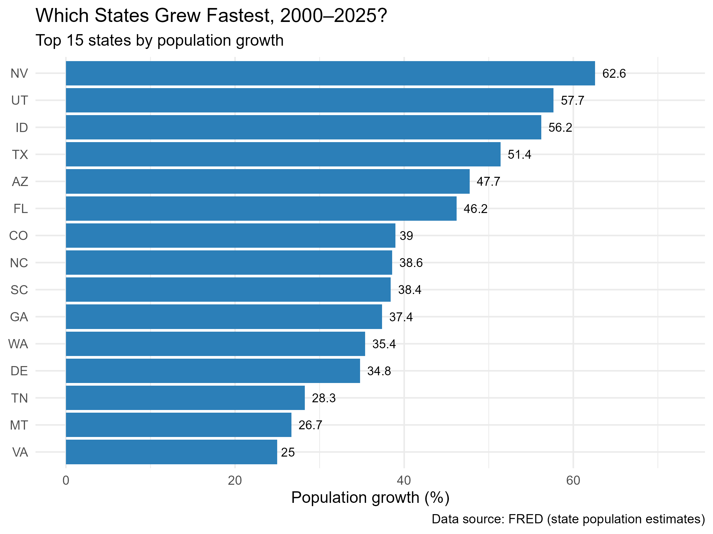
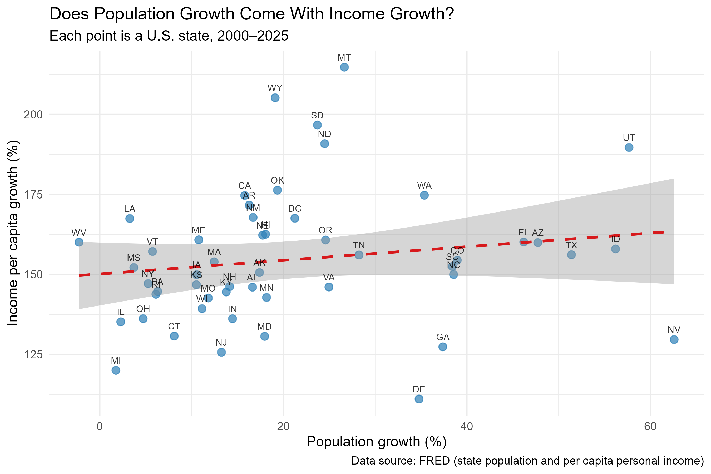

---

## Introduction

The amount of population that moves between different states within the United States is quite large.There are many reasons for this flow, such as lower taxes, more job opportunities, and cheaper living cost. 

However, can we determine the income level of the destination state based on the direction of immigration?

This analysis uses data from the **Federal Reserve Economic Data
(FRED)** system to examine population and income trends across
all 50 U.S. states (plus D.C.) from 2000 to 2025. The data is
retrieved programmatically through the `fredr` R package with API Key. 

## How to measure

I used two annual series for each state:

- **Population** (`{state}POP`) — resident population in thousands
- **Per capita personal income** (`{state}PCPI`) — total personal
  income divided by population, in current dollars

Using per capita income is essential
when comparing states of different sizes.

All dollar figures are adjusted to constant dollars using the
FRED series, so comparisons across years are not distorted by
inflation.

I collected data for all 51 jurisdictions (50 states plus the
District of Columbia) from 2000 through 2025 — about 2,650
observations in total.

## Finding 1: Growth Is Concentrated in the West and South

{width=90%} 

The fastest-growing states are all in the West and South:
**Nevada (+63%), Utah (+58%), Idaho (+56%), Texas (+51%),
Arizona (+48%), and Florida (+46%)**.

{width=90%}  

The slowest-growing states are all in the Midwest and Northeast:
**West Virginia (-2.3%), Michigan (+1.8%), Illinois (+2.3%),
Louisiana (+3.3%), and Mississippi (+3.7%)**.

West Virginia is the only state that **lost population** over
the period. This is consistent with long-running trend of out-migration of young workers, declining coal
employment, and an aging population in that area.

## Finding 2: Population Growth Does Not Mean Income Growth

{width=90%}

If population growth were a sign of economic success, we would
expect the fastest-growing states to also show the fastest
income growth. The data shows no such relationship.

The trend line in the scatter plot is **almost flat**. Population
growth and per capita income growth are essentially uncorrelated
across states.

Two states make this vivid:

- **Nevada**: population growth of 63% (the highest in the
  country), but income growth of only 135% — among the lowest.
- **Michigan**: population growth of just 1.8%, but income
  growth of only 120% — the lowest in the country.

Nevada and Michigan sit at opposite ends of the population
distribution but share a similar income trajectory. Whatever
is driving income growth, it is not population growth.

## Finding 3: Slow-Growing States Have Bigger Internal Gaps

{width=90%}

The final piece of the puzzle comes from looking at income
levels, not growth rates.

Among **population-fast-growing states**, per capita income is relatively
tight: all six states end the period between $65,000 and $77,000.

Among **population-slow-growing states**, the range is much wider:
Illinois reaches nearly $80,000 by 2025, while Mississippi
remains near $55,000.

In this case, **Population growth is not a
signal of prosperity, but population stagnation is not a
signal of decline either.** Illinois has one of the highest
per capita incomes in the country while the resident number there is basically stable. 

## Conclusion

1. **Migration cannot be considered as a weatherwane for income per capita**
   Nevada, Georgia, and Delaware all grew quickly but had some
   of the slowest income growth in the country. Meanwhile, Illinois and New York have high and rising per capita
   incomes. They are losing residents to cheaper places, not
   to more productive ones.

3. **Income growth is not driven by population.** The two
   variables are nearly uncorrelated across states and over
   time. What actually drives income growth — industry mix,
   education levels, productivity — is a separate question.

## Limitations

This analysis has several limitations:

- **Per capita income is a crude measure.** It divides total
  income by total population, including children and retirees
  who do not earn income.
- **No cost-of-living adjustment.** A dollar in Mississippi
  buys more than a dollar in California, but this analysis
  treats them as equal.
- **Population estimates, not census counts.** FRED uses
  annual estimates between decennial censuses, which can
  diverge from actual counts.
- **Simple correlation.** The analysis describes patterns,
  not causes. It does not explain why some states grow and
  others do not.

---

*Data source: [FRED](https://fred.stlouisfed.org/), Federal
Reserve Bank of St. Louis. State population (`{state}POP`) and
per capita personal income (`{state}PCPI`), 2000–2025. All data
retrieved programmatically through the `fredr` R package. Full
code is available in the
[project repository](https://github.com/chelseacui0219-hue/blog4).*